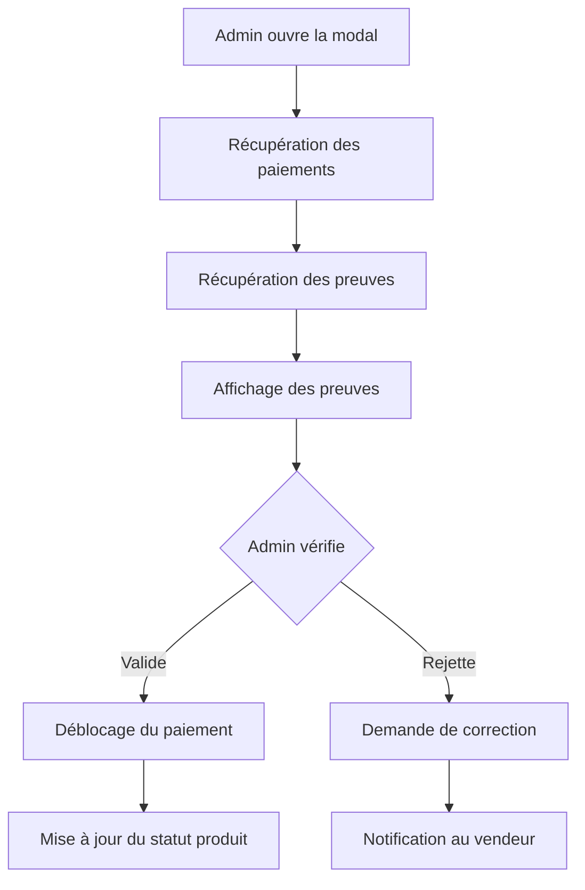

# Vérification des Expéditions par les Admins

## Vue d'ensemble

Cette fonctionnalité permet aux administrateurs de vérifier et valider les preuves d'expédition soumises par les vendeurs via le `ShippingProofForm`.

## Interface Admin

### **📍 Accès :**

- **Page :** `/admin/products`
- **Action :** Menu déroulant → "Vérifier les expéditions"
- **Modal :** Interface de vérification complète

### **🎯 Fonctionnalités :**

#### **1. Liste des preuves par produit :**

- **Récupération automatique** des paiements du produit
- **Preuves associées** à chaque paiement
- **Statut en temps réel** de chaque preuve

#### **2. Interface de vérification :**

- **Photos haute résolution** des preuves
- **Informations détaillées** de la transaction
- **Numéro de suivi** Colissimo
- **Description du vendeur**

#### **3. Actions de validation :**

- **Valider la preuve** → Débloque le paiement
- **Rejeter la preuve** → Demande de correction
- **Historique complet** des vérifications

## Architecture technique

### **API Endpoints :**

#### GET /api/admin/products/[productId]/payments

```typescript
// Récupération des paiements d'un produit
{
  payments: [
    {
      id: string;
      amount: number;
      status: string;
      productId: string;
      buyer: {
        id: string;
        username: string;
        email: string;
      };
      seller: {
        id: string;
        username: string;
        email: string;
      };
      createdAt: string;
    }
  ]
}
```

#### PUT /api/admin/shipping-proofs/[proofId]/verify

```typescript
// Vérification d'une preuve
Request: {
	status: "verified" | "rejected";
}

Response: {
	message: string;
	proof: ShippingProof;
}
```

### **Flux de vérification :**



## Interface utilisateur

### **Modal de vérification :**

#### **En-tête :**

```
📦 Vérification des expéditions
Vérifiez les preuves d'expédition soumises pour ce produit
```

#### **Contenu de chaque preuve :**

```
✅ Preuve d'expédition #ABC123
Paiement: #XYZ789 - 150.00€

👤 Acheteur: Jean Dupont (jean@email.com)
👤 Vendeur: Marie Martin (marie@email.com)

📦 Numéro de suivi: 1A2B3C4D5E6F

📸 Photos des preuves:
├── 🧾 Reçu d'affranchissement
└── 📦 Photo du colis

📝 Description: Colis emballé avec soin

⏰ Soumise le: 15 janvier 2024 à 14:30
```

#### **Actions disponibles :**

- **Valider la preuve** (si status = "pending_verification")
- **Rejeter la preuve** (si status = "pending_verification")
- **Fermer la modal**

## Processus de validation

### **1. Vérification automatique :**

- **Numéro de suivi** : Validation API La Poste
- **Format des images** : Taille, type, résolution
- **Données de base** : Présence des champs obligatoires

### **2. Vérification manuelle :**

- **Contenu des reçus** : Montant, date, validité
- **Photos du colis** : Contenu, étiquette, emballage
- **Cohérence globale** : Logique entre les preuves

### **3. Actions de l'admin :**

#### **Validation :**

```typescript
// Débloque automatiquement le paiement
await prisma.payment.update({
	where: { id: paymentId },
	data: { status: "succeeded" },
});

// Met à jour le statut du produit
await prisma.product.update({
	where: { id: productId },
	data: { status: "sold" },
});
```

#### **Rejet :**

```typescript
// Marque la preuve comme rejetée
await prisma.shippingProof.update({
	where: { id: proofId },
	data: {
		status: "rejected",
		verifiedAt: new Date(),
		verifiedBy: adminId,
	},
});
```

## Sécurité et autorisations

### **1. Contrôle d'accès :**

- **Authentification** : Utilisateur connecté requis
- **Autorisation** : Rôle "admin" obligatoire
- **Validation** : Vérification des permissions

### **2. Traçabilité :**

- **Historique complet** des vérifications
- **Admin responsable** enregistré
- **Horodatage** des actions

### **3. Protection des données :**

- **Chiffrement** des données sensibles
- **Audit trail** complet
- **Conformité RGPD**

## Avantages pour votre mémoire

### **1. Contrôle qualité :**

- **Vérification humaine** des preuves
- **Décisions éthiques** et responsables
- **Protection contre la fraude**

### **2. Transparence :**

- **Processus clair** et documenté
- **Traçabilité complète** des actions
- **Responsabilité** des décisions

### **3. Innovation technique :**

- **Interface intuitive** pour les admins
- **Intégration Cloudinary** pour les images
- **API robuste** et sécurisée

## Monitoring et analytics

### **Métriques suivies :**

- **Taux de validation** des preuves
- **Délais de vérification** moyens
- **Types de rejets** les plus fréquents
- **Performance** des admins

### **Alertes automatiques :**

- **Preuves en attente** depuis plus de 48h
- **Rejets répétés** d'un même vendeur
- **Anomalies** détectées dans les preuves

## Évolutions futures

### **1. Intelligence artificielle :**

- **Détection automatique** de faux reçus
- **Analyse d'images** pour vérifier les colis
- **Prédiction de risques** de fraude

### **2. Automatisation :**

- **Validation automatique** pour les vendeurs fiables
- **Rejet automatique** pour les preuves suspectes
- **Notifications intelligentes**

### **3. Interface avancée :**

- **Zoom sur les images** pour vérification détaillée
- **Comparaison** avec d'autres preuves
- **Historique** des vendeurs

Cette fonctionnalité offre un contrôle qualité optimal tout en maintenant la sécurité et la transparence ! 🎯
