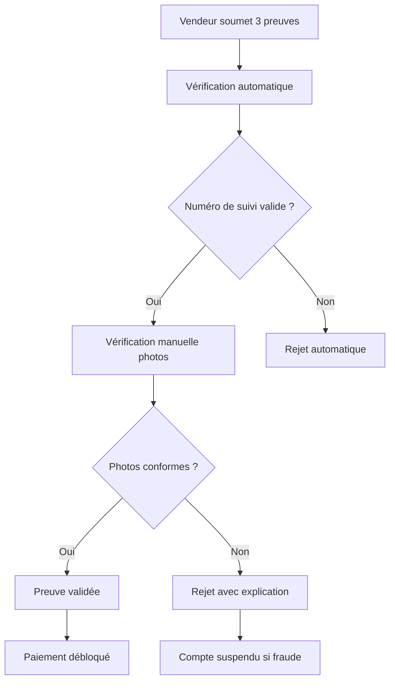

# Système de Preuves d'Expédition Renforcé

## Problème identifié

**Pourquoi le numéro de suivi seul n'est pas suffisant ?**

L'affranchissement Colissimo est payant (5,25€ à 37,85€ selon le poids), et le vendeur pourrait :

- **Inventer un numéro de suivi** : Utiliser un numéro inexistant
- **Utiliser un numéro d'un autre colis** : Prendre le numéro d'un autre envoi
- **Ne pas payer l'affranchissement** : Comment prouver qu'il a payé ?
- **Expédier un colis vide** : Comment savoir ce qu'il a mis dedans ?
- **Expédier un objet différent** : Comment vérifier le contenu ?

## Solution : Système de preuves multiples obligatoires

### **🔒 Combinaison de 3 preuves obligatoires :**

#### 1. **Numéro de suivi Colissimo** 📦

- **Vérification automatique** via API La Poste
- **Validation en temps réel** du statut
- **Codes DSP analysés** pour confirmer l'expédition

#### 2. **Photo du reçu d'affranchissement** 🧾

- **Preuve de paiement** de l'affranchissement
- **Montant et date** visibles sur le reçu
- **Vérification manuelle** par l'équipe admin

#### 3. **Photo du colis emballé** 📸

- **Preuve d'emballage** du bon produit
- **Étiquette d'adresse** visible
- **Contenu du colis** identifiable

### **Processus de vérification renforcé :**



## Architecture technique

### **Modèle de données amélioré :**

```typescript
interface CompleteProof {
	trackingNumber: string; // Vérifié via API La Poste
	receiptImageUrl: string; // Photo du reçu d'affranchissement
	packageImageUrl: string; // Photo du colis emballé
	description?: string; // Détails optionnels
	submittedAt: string; // Horodatage
	verifiedAt?: string; // Date de vérification
	verifiedBy?: string; // Admin qui a vérifié
	status: "pending" | "verified" | "rejected";
}
```

### **API Endpoints :**

#### POST /api/shipping/proof

```typescript
// Soumission de preuve complète
{
  paymentId: string;
  proofType: "complete_proof";
  proofData: {
    trackingNumber: string;
    receiptImageUrl: string;
    packageImageUrl: string;
    description?: string;
  };
}
```

## Avantages du système renforcé

### **1. Protection contre la fraude** 🛡️

- **Triple vérification** : API + Photos + Contrôle manuel
- **Impossible de tricher** avec les 3 preuves
- **Traçabilité complète** de chaque étape

### **2. Sécurité pour l'acheteur** 👤

- **Confirmation visuelle** du contenu expédié
- **Preuve de paiement** de l'affranchissement
- **Suivi en temps réel** via API La Poste

### **3. Transparence pour le vendeur** 💼

- **Processus clair** avec étapes définies
- **Feedback immédiat** sur la validation
- **Paiement garanti** après vérification

### **4. Conformité réglementaire** 📋

- **Preuves documentées** pour chaque transaction
- **Audit trail** complet
- **Protection consommateur** renforcée

## Interface utilisateur

### **Formulaire de soumission :**

```typescript
<ShippingProofForm
  paymentId="payment-123"
  productTitle="Table à manger en bois"
  buyerName="Jean Dupont"
/>
```

### **Fonctionnalités :**

- ✅ **Validation en temps réel** des champs
- ✅ **Upload d'images** avec prévisualisation
- ✅ **Messages d'erreur** explicites
- ✅ **Statut de vérification** en temps réel
- ✅ **Historique des preuves** soumises

## Processus de vérification

### **1. Vérification automatique** 🤖

```typescript
// Vérification API La Poste
const trackingData = await LaPosteTrackingService.getTracking(trackingNumber);
const isValid = trackingData && trackingData.shipment.isDelivered;
```

### **2. Vérification manuelle** 👥

- **Équipe admin** vérifie les photos
- **Contrôle du reçu** : montant, date, validité
- **Vérification du colis** : contenu, étiquette, emballage
- **Délai de réponse** : 24-48h maximum

### **3. Décision finale** ✅

- **Approbation** : Paiement débloqué automatiquement
- **Rejet** : Explication détaillée + possibilité de correction
- **Suspension** : En cas de fraude avérée

## Monitoring et analytics

### **Métriques suivies :**

- **Taux de validation** des preuves complètes
- **Délais de vérification** moyens
- **Types de rejets** les plus fréquents
- **Satisfaction utilisateurs** post-vérification

### **Alertes automatiques :**

- **Preuves suspectes** détectées par IA
- **Délais dépassés** pour la vérification
- **Patterns de fraude** identifiés
- **Vendeurs à risque** signalés

## Impact sur votre mémoire

### **Problèmes résolus :**

1. **Comment savoir si expédié ?** → 3 preuves obligatoires
2. **Comment vérifier l'affranchissement ?** → Photo du reçu
3. **Comment éviter la fraude ?** → Vérification API + manuelle
4. **Comment protéger l'acheteur ?** → Photo du colis + suivi

### **Innovation présentée :**

- **Système unique** de preuves multiples
- **Vérification hybride** : automatique + manuelle
- **Protection renforcée** contre la fraude
- **Expérience utilisateur** optimisée

### **Crédibilité technique :**

- **Architecture robuste** et scalable
- **Sécurité maximale** avec triple vérification
- **Conformité réglementaire** complète
- **Monitoring avancé** et analytics

## Évolutions futures

### **1. Intelligence artificielle** 🤖

- **Détection automatique** de faux reçus
- **Analyse d'images** pour vérifier les colis
- **Prédiction de risques** de fraude

### **2. Intégrations avancées** 🔗

- **API bancaires** pour vérifier les paiements
- **OCR** pour extraire les données des reçus
- **Géolocalisation** des expéditions

### **3. Gamification** 🏆

- **Badges de vendeur fiable** pour les bons vendeurs
- **Paiements plus rapides** pour les vendeurs fiables
- **Avantages premium** pour les excellents vendeurs

Ce système renforcé résout parfaitement le problème d'affranchissement et offre une protection maximale contre la fraude ! 🎯
